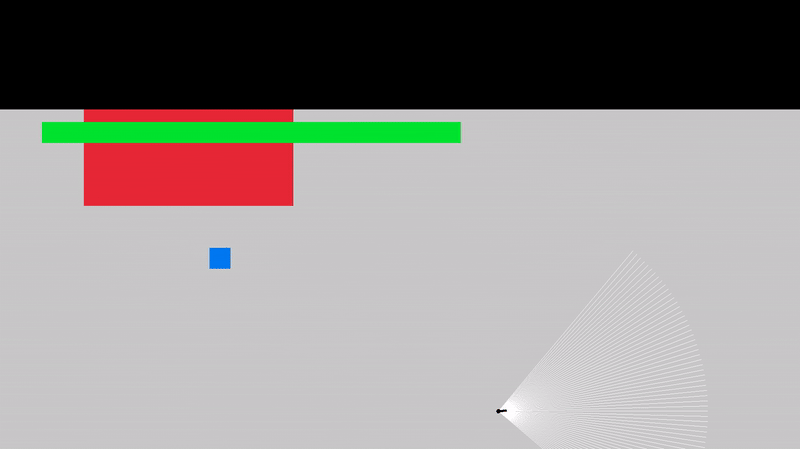
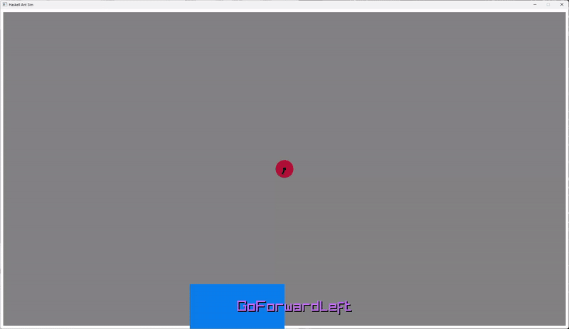

# Haskell Ant Sim

Agent-based ant foraging simulation in Haskell.





## Features

- Realistic ant movement.
- 1D ant vision inspired by the 1884 book Flatland.
- Neural network ant brains.
- Genetic algorithm to train the ant brains.


## Installation

```
git clone https://github.com/OlegAlexander/haskell-ant-sim.git
cd haskell-ant-sim
stack run ant-sim
```

## Controls

- Use arrow keys to move the red player ant.
- Press W and drag the mouse to start drawing a wall. Press W again to finish drawing a wall.
- Left click to place a food. Holding down the mouse places more food. 
- Right click on walls or food to delete them.
- Press D to toggle debug text.
- Press N to toggle a visualization of the neural network. The input vector is on top. The output vector and movement decision text is on the bottom.
- Press R to toggle the player ant's vision rays.
- Press V toggle a 1D first person view for the player ant.
- Press C to toggle the home compass.
- Press T to start a new training session. To start completely from scratch, set `usePretrainedBrains` to `False` in `shared/src/Constants.hs`. Training can take several days.
- Many parameters can be adjusted in `shared/src/Constants.hs`.

## Why?

- Can I learn Haskell in a fun way as opposed to just reading a book?
- Can I simulate realistic ant foraging behavior?
- Can I use a neural network for the ant brains?
- Can I use a genetic algorithm to train the ant brains?
- Is Haskell suitable for game development?
